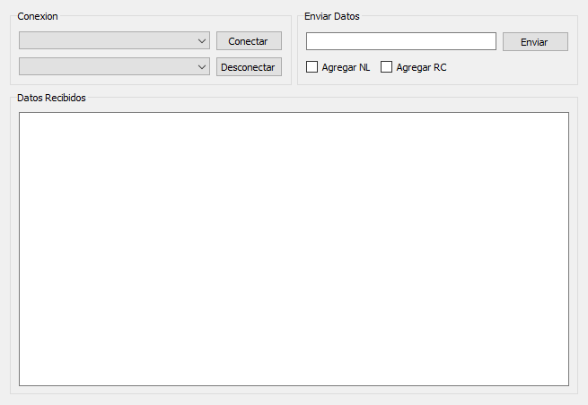

** ACTUALMENTE SE ENCUENTRA OBSOLETA **

# SerialConsole

Consola Serial Para Interactuar Con Microcontroladores PIC 18F4550/2550

Requerimientos:

*PySide 1.2.4*

*Pyserial 2.7*

Ejecutar Main.py

Por el Momento solo funciona en Windows

